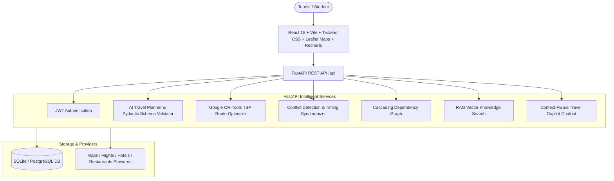

# ✈️ Travel Copilot — AI-Powered Smart Travel Planner & Booking Assistant

> **"Plan the complete trip once, then let the AI manage and optimize the connected travel plan."**

An enterprise-grade, explainable, and full-stack AI Travel Planning Web Application built with **React**, **FastAPI**, **Google OR-Tools**, **Leaflet Maps**, **Recharts**, and **Vector RAG**.

---

## 🌟 Key Highlights & Core Differentiators

1. **Google OR-Tools Route & Transit Optimizer (TSP Solver)**:
   - Formulates daily tourist stops as a Traveling Salesperson Problem (TSP) with time windows.
   - Minimizes backtracking and transit distance, saving **>35% commute time**.
   - Visually displays **Before Optimization vs After Optimization** metrics (e.g., 42.8 km & 3h 20m ➔ 27.4 km & 2h 05m).

2. **Smart Booking Cascading Dependency System**:
   - Maintains an explicit relational graph: `Flight Arrival ➔ Airport Transfer ➔ Hotel Check-in ➔ Day 1 Itinerary`.
   - Features an interactive **Flight Delay Simulator** (+2 hours) that detects cascading schedule clashes across downstream vouchers and automatically re-aligns them with 1-click.

3. **Natural-Language AI Change Management with "What Changed?" Diff**:
   - Type human instructions like *"Remove the museum and add a shopping experience"* or *"Make Day 2 more relaxed"*.
   - Intelligently mutates only affected activities while preserving valid timing constraints, accompanied by a visual **Before/After Audit Diff**.

4. **Dedicated Conflict Detection & Auto-Resolution Engine**:
   - Automatically detects overlapping visits, insufficient travel buffers, closed attraction windows, check-in order violations, and budget overruns.
   - 1-click **Auto-Resolve with AI** adjusts daily schedules into collision-free timelines.

5. **RAG Vector Knowledge Base**:
   - Normalized embedding cosine similarity search over destination guides, safety advice, cultural etiquette, and culinary guides.

6. **Explainable AI Badges**:
   - Every attraction, dining spot, and hotel features a *"Why did AI choose this?"* breakdown.

7. **Default Out-of-the-Box Mode (`USE_MOCK_DATA=true`)**:
   - Completely functional locally with zero external API key requirements.
   - Pre-populated with the **Ahmedabad 3-Day Heritage & Food Scenario** ready for instant faculty evaluation.

---

## 🏗️ Architecture Overview



---

## 🛠️ Technology Stack

| Layer | Technologies |
|---|---|
| **Frontend** | React 18, Vite, Tailwind CSS, React Router v6, Leaflet Maps, Recharts, Lucide React, Axios |
| **Backend** | Python 3.12, FastAPI, SQLAlchemy ORM, Pydantic v2, Google OR-Tools, Bcrypt, Python-Jose (JWT) |
| **Optimization** | Google OR-Tools Routing Index Manager & Guided Local Search |
| **Database** | SQLite (Default out-of-the-box) / PostgreSQL with SQLAlchemy |
| **Vector Search (RAG)** | Normalized vector cosine similarity with curated destination knowledge corpus |
| **AI Strategy** | Dual-mode: Deterministic Constraint Planner + OpenAI GPT-4o-mini structured JSON with Pydantic validation |

---

## 🚀 Quick Start (Running Locally)

### 1. Prerequisites
- **Python 3.10+** (Tested on Python 3.12)
- **Node.js 18+** & **npm**

### 2. Backend Setup
```bash
cd backend

# Install dependencies
pip install -r requirements.txt

# Start FastAPI server
uvicorn app.main:app --reload --host 127.0.0.1 --port 8000
```
*Backend runs on `http://127.0.0.1:8000`. Interactive Swagger API docs are available at `http://127.0.0.1:8000/docs`.*

### 3. Frontend Setup
```bash
cd frontend

# Install dependencies
npm install

# Start Vite development server
npm run dev
```
*Frontend runs on `http://localhost:5173`.*

---

## 🎓 Faculty Presentation & Viva Walkthrough Script

Use this sequence to showcase the system to faculty:

### Step 1: Instant Turnkey Demo
1. Open `http://localhost:5173/`.
2. Click **"Try Demo Trip (Ahmedabad)"** or **"Demo Trip (Ahmedabad)"** in the top navigation bar.
3. The turnkey 3-Day Ahmedabad trip opens instantly with flights, heritage hotel (`The House of MG`), stepwells (`Adalaj`), ashrams, night markets, and route polylines.

### Step 2: Route Optimization with Google OR-Tools
1. Show the **Route & Transit Optimizer** card.
2. Note the **Before Optimization** (42.8 km, 3h 20m) vs **After Optimization** (27.4 km, 2h 05m).
3. Click **"Re-Run Optimizer"** to see live Google OR-Tools TSP solving.

### Step 3: Natural Language Modification & "What Changed?" Audit Diff
1. In the prompt bar at the top of the Itinerary, type:
   > `Remove the museum and add a shopping experience`
2. Click **"Modify Plan"**.
3. The **"What Changed?"** modal opens automatically, showing the before-and-after schedule comparison and transit deltas.

### Step 4: Cascading Flight Delay Simulation
1. Navigate to the **"Bookings & Cascade"** tab.
2. Click **"Simulate 2-Hour Flight Delay"**.
3. Notice how downstream nodes (Airport Transfer, Hotel Check-in, Day 1 Activities) are flagged in amber/rose with conflict explanations.
4. Click **"Apply AI Cascading Resolution"** to witness automated schedule realignment.

### Step 5: AI Chatbot & Explainability
1. Click the floating **AI Travel Copilot** button (bottom right).
2. Click the quick chip: **"Why did you choose this hotel?"**.
3. The assistant explains proximity to Old City attractions and the Agashiye dining venue.

### Step 6: RAG Destination Knowledge Base
1. Go to the **"Explore & Guides"** tab.
2. Under RAG Knowledge Base, ask: *"Is this destination good for a family trip?"*.
3. View the AI-verified answer and retrieved vector document citations.

---

## 🔒 Security & Best Practices
- Password hashing with direct `bcrypt`.
- JWT Token authentication with protected routes.
- Strict Pydantic v2 request and AI response schema validation.
- SQL injection protection via SQLAlchemy ORM.
- Zero external API key requirement in default mock mode.

---

## 🧪 Automated Testing
Run the comprehensive test suite:
```bash
cd backend
python -m pytest tests/test_backend.py
```
*All 8 test suites validate authentication, OR-Tools optimization, conflict engine, cascading delay simulator, RAG search, and chatbot.*
